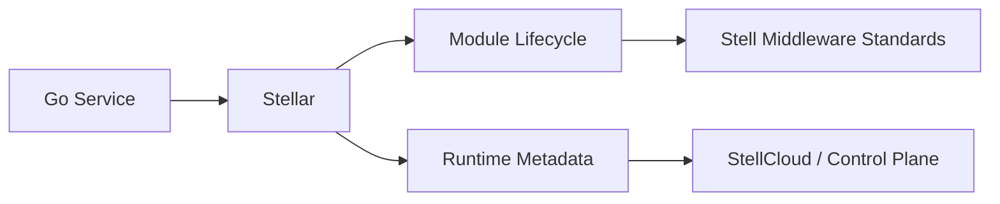

# Stellar

`stellar` is the Go framework for the Stell middleware ecosystem. It provides a unified application foundation for services that need to integrate Stell standards for configuration, discovery, messaging, observability, governance, and platform operations.

It has the same positioning as [`stellhub/stellflux`](https://github.com/stellhub/stellflux), while following Go conventions: small packages, explicit composition, context propagation, standard library first, and predictable lifecycle management.

## Positioning

Stellar is not a middleware server and does not implement business logic. It is a framework layer for Go services that need a consistent way to adopt Stell middleware capabilities.

## Core Responsibilities

- Provide unified application configuration and runtime metadata.
- Define a lightweight module lifecycle for Stell middleware integrations.
- Standardize how Go services connect to StellMap, StellFlow, StellNula, StellSpec, StellOrbit, StellGate, and StellAtlas.
- Expose framework status for health checks, control planes, and platform consoles.
- Keep observability, service identity, environment, and zone metadata consistent across services.

## Middleware Standards

| Standard | Responsibility |
| --- | --- |
| StellMap | Service discovery and registry integration |
| StellFlow | Messaging and event streaming integration |
| StellNula | Configuration center integration |
| StellSpec | Observability and log query standard integration |
| StellOrbit | Traffic governance, routing, retries, and lifecycle policy integration |
| StellGate | API gateway and ingress standard integration |
| StellAtlas | CMDB, asset inventory, topology, and lifecycle metadata integration |

## Current Status

| Item | Value |
| --- | --- |
| Stability | Early development |
| Language | Go |
| Project type | Go framework |
| Target users | Go microservices, platform services, infrastructure components |
| Maintainer | StellHub |

## Quick Start

Install the module:

```bash
go get github.com/stellhub/stellar
```

Create an application:

```go
package main

import (
	"context"
	"log"

	"github.com/stellhub/stellar"
)

func main() {
	app := stellar.New(stellar.Config{
		AppName:     "example-service",
		Environment: stellar.EnvDev,
		Zone:        "local",
	})

	app.Use(stellar.StandardModules()...)

	if err := app.Start(context.Background()); err != nil {
		log.Fatal(err)
	}
	defer app.Stop(context.Background())
}
```

Run the included example:

```bash
go run ./cmd/stellar-example
```

Then open:

```text
GET http://localhost:8080/health
GET http://localhost:8080/stellar/status
```

## Configuration Model

| Field | Required | Description |
| --- | --- | --- |
| AppName | Yes | Logical application name |
| Environment | Yes | Runtime environment, such as `dev`, `uat`, `pre`, or `prod` |
| Zone | No | Availability zone or logical deployment zone |
| Disabled | No | Whether framework modules should be skipped during startup |

## Architecture



## Development

Run tests:

```bash
go test ./...
```

Format code:

```bash
gofmt -w .
```

## Compatibility

Stellar follows semantic versioning once the public API stabilizes:

- `MAJOR`: incompatible API or runtime behavior changes.
- `MINOR`: backward-compatible modules, standards, or APIs.
- `PATCH`: backward-compatible fixes.

## Contribution Guidelines

- New middleware integrations should be exposed as explicit modules.
- Public API changes must describe compatibility impact.
- Framework code should prefer the Go standard library unless an external dependency provides clear value.
- Context propagation is required for startup, shutdown, client calls, and background tasks.

## License

The license will be defined before the first stable release.
