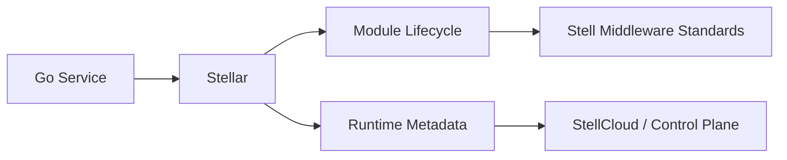

# Stellar

`stellar` is the Go framework for the Stell middleware ecosystem. It provides a unified application foundation for services that need to integrate Stell standards for configuration, discovery, messaging, observability, governance, and platform operations.

It has the same positioning as [`stellhub/stellflux`](https://github.com/stellhub/stellflux), while following Go conventions: small packages, explicit composition, context propagation, standard library first, and predictable lifecycle management.

## Positioning

Stellar is not a middleware server and does not implement business logic. It is a framework layer for Go services that need a consistent way to adopt Stell middleware capabilities.

## Core Responsibilities

- Provide unified application configuration and runtime metadata.
- Define a lightweight module lifecycle for Stell middleware integrations.
- Standardize how Go services connect to StellMap, StellFlow, StellNula, StellSpec, StellOrbit, StellGate, and StellAtlas.
- Expose framework status for health checks, control planes, and platform consoles.
- Keep observability, service identity, environment, and zone metadata consistent across services.

## Middleware Standards

| Standard | Responsibility |
| --- | --- |
| StellMap | Service discovery and registry integration |
| StellFlow | Messaging and event streaming integration |
| StellNula | Configuration center integration |
| StellSpec | Observability and log query standard integration |
| StellOrbit | Traffic governance, routing, retries, and lifecycle policy integration |
| StellGate | API gateway and ingress standard integration |
| StellAtlas | CMDB, asset inventory, topology, and lifecycle metadata integration |

## Current Status

| Item | Value |
| --- | --- |
| Stability | Early development |
| Language | Go |
| Project type | Go framework |
| Target users | Go microservices, platform services, infrastructure components |
| Maintainer | StellHub |

## Quick Start

Install the module:

```bash
go get github.com/stellhub/stellar
```

Create an application:

```go
package main

import (
	"log"

	"github.com/stellhub/stellar"
)

func main() {
	if err := stellar.Start(); err != nil {
		log.Fatal(err)
	}
}
```

Add `application.yml`:

```yaml
app:
  name: example-service
  env: dev
  zone: local
http:
  server:
    enabled: true
    port: 8080
    adapter: gin
    observability:
      trace: true
      metrics: true
      logs: true
  client:
    enabled: true
    timeout: 3s
    max_idle_conns: 100
    max_idle_conns_per_host: 10
    idle_conn_timeout: 90s
    observability:
      trace: true
      metrics: true
      logs: false
    clients:
      user-service:
        base_url: http://localhost:8081
        timeout: 2s
      order-service:
        base_url: http://localhost:8082
        timeout: 5s
grpc:
  server:
    enabled: true
    port: 9090
    adapter: grpc-go
    observability:
      trace: true
      metrics: true
      logs: true
  client:
    enabled: true
    timeout: 3s
    insecure: true
    observability:
      trace: true
      metrics: true
      logs: false
    clients:
      user-service:
        target: dns:///localhost:9091
        timeout: 2s
      order-service:
        target: dns:///localhost:9092
        timeout: 5s
opentelemetry:
  trace: true
  metrics: true
```

Run the included HTTP example:

```bash
go run ./examples/http-examples
```

Then open:

```text
GET http://localhost:8080/health
GET http://localhost:8080/stellar/status
GET http://localhost:8080/metrics
```

Run the included gRPC example:

```bash
go run ./examples/grpc-examples
```

## Transport Adapters

Stellar keeps HTTP and RPC behind adapter interfaces.

| Layer | Default | Optional implementations |
| --- | --- | --- |
| HTTP | Gin | Hertz, Chi |
| RPC | gRPC-Go | Other RPC adapters can be added later |

HTTP applications can switch adapters without changing business handlers:

```go
app := stellar.New(cfg, stellar.WithHTTPServer(":8080")) // default Gin
```

HTTP server and HTTP client use separate configuration sections:

```yaml
http:
  server:
    enabled: true
    port: 8080
    adapter: gin
    observability:
      trace: true
      metrics: true
      logs: true
  client:
    enabled: true
    timeout: 3s
    max_idle_conns: 100
    max_idle_conns_per_host: 10
    idle_conn_timeout: 90s
    observability:
      trace: true
      metrics: true
      logs: false
    clients:
      user-service:
        base_url: http://localhost:8081
        timeout: 2s
      order-service:
        base_url: http://localhost:8082
        timeout: 5s
```

RPC applications use the same lifecycle model:

```go
app := stellar.New(cfg, stellar.WithRPCServer(":9090")) // default gRPC-Go
```

gRPC server and gRPC client also use separate configuration sections. Only `grpc.server` starts a listener; `grpc.client` only configures outbound client connections:

```yaml
grpc:
  server:
    enabled: true
    port: 9090
    adapter: grpc-go
    observability:
      trace: true
      metrics: true
      logs: true
  client:
    enabled: true
    timeout: 3s
    insecure: true
    observability:
      trace: true
      metrics: true
      logs: false
    clients:
      user-service:
        target: dns:///localhost:9091
        timeout: 2s
      order-service:
        target: dns:///localhost:9092
        timeout: 5s
```

## OpenTelemetry

Stellar instruments HTTP server, gRPC server, HTTP client, and gRPC client with OpenTelemetry trace, logs, and metrics.

Stellar reads `application.yml` or `application.yaml` from the directory that contains `main.go`, then from the current working directory.

OpenTelemetry defaults:

- `log`: defaults to local `stdout`/`stderr`; set `log.enabled: false` with `log.output: file` for local rolling files, or set `log.enabled: true` for OTLP export to `localhost:4317`.
- `trace`: when enabled, spans are generated without export; set `trace_output: otlp` for `localhost:4317`.
- `metrics`: when enabled, exposes `/metrics` on the configured HTTP port; set `metrics_output: otlp` for `localhost:4317`.

Example with explicit OTLP output:

```yaml
opentelemetry:
  log:
    enabled: true
    endpoint: localhost:4317
  trace: true
  metrics: true
  endpoint: localhost:4317
  trace_output: otlp
  metrics_output: otlp
```

Example with local rolling files:

```yaml
opentelemetry:
  log:
    enabled: false
    output: file
    dir: logs
    file_name: app.log
    max_size_bytes: 104857600
    max_backups: 5
```

When using the programmatic API, create an instrumented HTTP client:

```go
client, baseURL, err := app.NewHTTPClient("user-service")
```

When using the programmatic API, create an instrumented gRPC-Go client:

```go
conn, _, err := app.NewGRPCClient(context.Background(), "user-service")
```

## Configuration Model

| Field | Required | Description |
| --- | --- | --- |
| AppName | Yes | Logical application name |
| Environment | Yes | Runtime environment, such as `dev`, `uat`, `pre`, or `prod` |
| Zone | No | Availability zone or logical deployment zone |
| Disabled | No | Whether framework modules should be skipped during startup |

## Architecture



## Development

Run tests:

```bash
go test ./...
```

Format code:

```bash
gofmt -w .
```

## Compatibility

Stellar follows semantic versioning once the public API stabilizes:

- `MAJOR`: incompatible API or runtime behavior changes.
- `MINOR`: backward-compatible modules, standards, or APIs.
- `PATCH`: backward-compatible fixes.

## Contribution Guidelines

- New middleware integrations should be exposed as explicit modules.
- Public API changes must describe compatibility impact.
- Framework code should prefer the Go standard library unless an external dependency provides clear value.
- Context propagation is required for startup, shutdown, client calls, and background tasks.

## License

The license will be defined before the first stable release.
