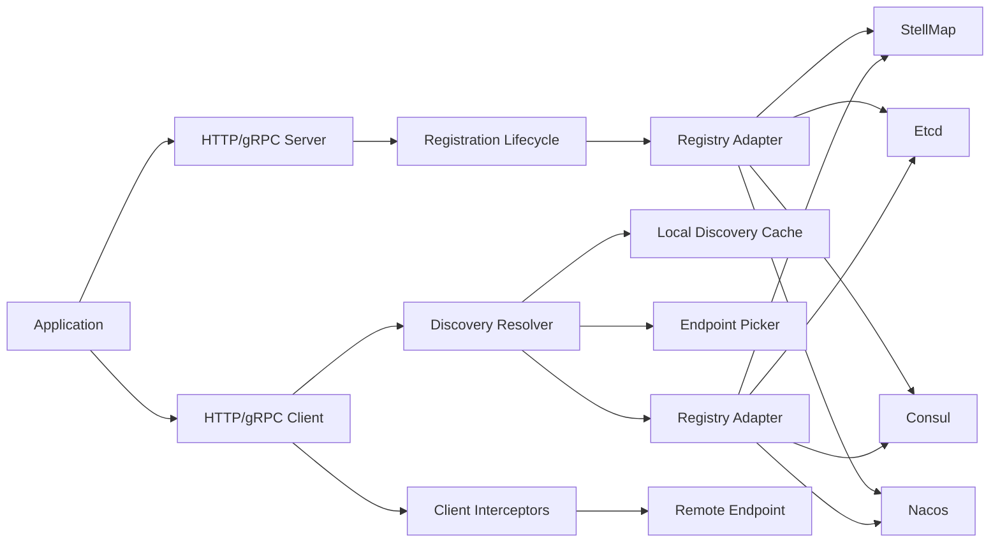

# 服务注册与服务发现架构设计

本文描述 Stellar 中服务注册与服务发现的职责边界、组件分层、配置模型和运行时流程。目标是让服务端注册、客户端发现、HTTP/gRPC 出站调用、治理拦截器和可观测性能够在同一套框架模型下演进。

## 设计目标

- 服务注册和服务发现解耦，分别面向服务端生命周期和客户端出站调用。
- 注册中心实现可插拔，支持 `stellmap`、`etcd`、`consul`、`nacos`。
- HTTP client 和 gRPC client 可以直接使用 discovery，不要求业务代码手动查询注册中心。
- 请求路径只访问本地 discovery 缓存，不在每次请求时直接访问注册中心。
- 服务发现结果可以接入负载均衡、超时、重试、熔断、限流、鉴权和业务 interceptor。
- 不强制服务注册使用的注册中心和服务发现使用的注册中心必须相同。

## 核心结论

服务注册和服务发现不应该强绑定。

```text
register 关心：当前服务实例发布到哪里
discovery 关心：下游服务实例从哪里发现
client 关心：最终选中的 endpoint 是否能正确访问
```

因此框架不应该强校验“当前应用注册到 StellMap，所以所有下游发现也必须走 StellMap”。这会破坏迁移期、多注册中心、历史系统兼容和本地开发等真实场景。

合理策略是：

- `registry` 负责当前应用实例注册。
- `discovery` 负责客户端发现下游服务。
- 如果 client 未显式配置 discovery，可以默认继承全局 `registry` 的连接配置。
- 如果 client 显式配置了不同注册中心，框架应该允许，并只在 debug/info 日志中提示。
- 框架只强校验 discovery 自身配置是否足够，例如 `service`、`protocol`、`endpoint_name`、`adapter/endpoints`。

## 总体架构



## 组件职责

### Registry Adapter

`registry.Adapter` 是对注册中心 SDK 的底层适配层，负责屏蔽 StellMap、Etcd、Consul、Nacos 的实现差异。

职责：

- 注册当前实例。
- 注销当前实例。
- 查询服务实例。
- 订阅实例变更。
- 关闭底层连接和后台任务。

它不应该承担客户端负载均衡、请求重试、熔断、路由治理等逻辑。

### Registration Lifecycle

Registration 属于服务端启动生命周期。

启动流程：

```text
load application.yml
-> create app
-> start HTTP/gRPC transports
-> register current instance to registry
```

停止流程：

```text
stop registry transport
-> deregister current instance
-> close registry client
-> stop HTTP/gRPC transports
```

当前实例可以同时暴露多个 endpoint，例如：

```yaml
registry:
  enabled: true
  adapter: stellmap
  endpoints:
    - http://localhost:18090
  namespace: default
  service: order-service
  instance_id: order-service-1
  service_endpoints:
    - name: http
      protocol: http
      host: 10.0.0.11
      port: 8080
    - name: grpc
      protocol: grpc
      host: 10.0.0.11
      port: 9090
```

### Discovery Resolver

Discovery Resolver 属于客户端出站调用链路。

职责：

- 根据客户端名称和 discovery 配置确定下游服务。
- 从注册中心查询或 watch 下游实例。
- 将实例转换为 HTTP/gRPC 可访问的 endpoint。
- 维护本地缓存。
- 在请求路径上提供 endpoint 选择能力。

推荐接口形态：

```go
type Resolver interface {
    Resolve(ctx context.Context, target Target) ([]Endpoint, error)
    Watch(ctx context.Context, target Target) (Watcher, error)
}
```

请求路径不应该每次都调用 `Resolve` 访问远端注册中心，而应该走本地缓存和 picker。

### Discovery Cache

Discovery Cache 保存 resolver 发现到的实例列表。

职责：

- 保存服务实例快照。
- 处理 watch 事件更新。
- 支持 TTL 或周期性 refresh。
- 支持 stale cache 策略，避免注册中心短暂故障直接打断业务请求。
- 提供只读快照给 picker。

建议策略：

- watch 可用时优先 watch。
- watch 不可用时 fallback 到周期性 refresh。
- 注册中心短暂不可用时保留上一份可用实例。
- 缓存为空时返回明确错误，让 client 的重试/熔断策略接手。

### Endpoint Picker

Picker 从本地缓存中选择一个 endpoint。

第一阶段建议支持：

- `round_robin`
- `random`
- `weighted_round_robin`

后续可以由服务治理规则扩展：

- zone-aware
- label selector
- canary
- traffic split
- locality routing

### HTTP/gRPC Client Integration

Discovery 应下沉到 HTTP client 和 gRPC client。

业务代码不应该频繁写：

```go
instances, err := app.ServiceRegistry().Discover(ctx, query)
```

这个 API 可以保留为底层能力、调试入口和特殊场景使用，但标准调用方式应该是：

```go
client, baseURL, err := app.NewHTTPClient("user-service")
conn, target, err := app.NewGRPCClient(ctx, "user-service")
```

当 named client 配置了 discovery 时，框架在内部完成：

```text
named client
-> discovery resolver
-> local cache
-> picker
-> selected endpoint
-> client interceptors
-> remote call
```

## 配置模型

### 当前服务注册

`registry` 描述当前应用如何注册自己。

```yaml
registry:
  enabled: true
  adapter: stellmap
  endpoints:
    - http://localhost:18090
  namespace: default
  service: order-service
  instance_id: order-service-1
  zone: zone-a
  ttl: 30s
  heartbeat_interval: 10s
  service_endpoints:
    - name: http
      protocol: http
      host: 10.0.0.11
      port: 8080
    - name: grpc
      protocol: grpc
      host: 10.0.0.11
      port: 9090
```

### HTTP Client Discovery

HTTP client 的 discovery 配置应该挂在具体 named client 下。

```yaml
http:
  client:
    enabled: true
    timeout: 3s
    clients:
      user-service:
        discovery:
          enabled: true
          adapter: consul
          endpoints:
            - http://localhost:8500
          namespace: default
          service: user-service
          protocol: http
          endpoint_name: http
          load_balance: round_robin
          refresh_interval: 10s
          stale_ttl: 1m
```

### gRPC Client Discovery

gRPC client 的 discovery 配置也应该挂在具体 named client 下。

```yaml
grpc:
  client:
    enabled: true
    timeout: 3s
    insecure: true
    clients:
      user-service:
        discovery:
          enabled: true
          adapter: stellmap
          endpoints:
            - http://localhost:18090
          namespace: default
          service: user-service
          protocol: grpc
          endpoint_name: grpc
          load_balance: round_robin
          refresh_interval: 10s
          stale_ttl: 1m
```

### 配置继承规则

推荐按下面优先级解析 discovery 配置：

```text
named client discovery
-> global discovery
-> registry connection config
-> static base_url / target
```

说明：

- named client discovery 是最明确的下游发现配置。
- global discovery 可以减少大量下游服务重复配置。
- registry connection config 只作为简单项目默认值复用，不能把当前服务的 `service/instance_id/service_endpoints` 继承给下游。
- 如果配置了静态 `base_url` 或 `target`，并且未启用 discovery，则继续走静态地址。

## 校验规则

### 不做强校验

不校验注册中心一致性：

```text
registry.adapter == http.client.clients.user-service.discovery.adapter
registry.adapter == grpc.client.clients.user-service.discovery.adapter
```

这些都不应该成为启动失败条件。

原因：

- 迁移期可能从 Consul 逐步切到 StellMap。
- 一个服务可能注册到内部注册中心，但调用外部服务走 Nacos。
- 测试环境、本地环境和生产环境可能使用不同 discovery 后端。
- 注册中心之间可能存在同步或桥接，框架无法判断部署拓扑是否合理。

### 必须校验

应该强校验 discovery 自身的可用性：

- `enabled=true` 时，必须能确定 adapter。
- `enabled=true` 时，必须能确定 registry endpoints，除非 adapter 支持默认地址。
- `service` 必填。
- `protocol` 必填或可从 client 类型推导。
- `endpoint_name` 可选，但配置后必须在实例 endpoints 中匹配。
- 没有可用实例时，返回清晰错误，并允许 retry/circuit breaker 处理。

## 请求时序

### HTTP Client

```text
business code
-> app.NewHTTPClient("user-service")
-> discovery resolver starts watch/refresh
-> request
-> pick http endpoint from local cache
-> build URL
-> context propagation
-> tracing/logging/metrics
-> timeout
-> retry
-> rate limit
-> circuit breaker
-> auth/signature
-> business interceptors
-> net/http round trip
```

### gRPC Client

```text
business code
-> app.NewGRPCClient(ctx, "user-service")
-> discovery resolver starts watch/refresh
-> grpc resolver or custom dial target receives endpoint updates
-> context propagation
-> tracing/logging/metrics
-> timeout
-> retry
-> rate limit
-> circuit breaker
-> auth/signature
-> business interceptors
-> grpc call
```

gRPC 更适合接入标准 resolver/balancer 模型，让 gRPC 连接层感知地址变更；HTTP client 可以在 RoundTripper 或 transport wrapper 中 pick endpoint。

## 可观测性

Discovery 应提供独立观测指标：

- resolver query count
- resolver watch reconnect count
- cache refresh count
- cache stale usage count
- available instance count
- endpoint pick count
- endpoint pick failure count

日志建议：

- discovery adapter 初始化。
- watch 中断和重连。
- cache 从空变为非空，或从非空变为空。
- 显式发现配置与全局注册配置使用不同 adapter 时输出 info/debug。

trace 建议：

- 初始化和刷新可以创建内部 span。
- 请求路径不建议每次创建 discovery 远端查询 span，因为请求路径应只走本地缓存。

## 失败处理

| 场景 | 建议行为 |
| --- | --- |
| 注册中心启动时不可用 | discovery client 初始化失败，应用启动是否失败由配置决定 |
| watch 中断 | 自动重连，并保留最后一份可用缓存 |
| refresh 失败 | 记录日志和指标，继续使用 stale cache |
| 缓存为空 | client 返回 `no available endpoint` |
| endpoint 请求失败 | 交给 retry/circuit breaker/interceptor 处理 |
| 注册和发现使用不同注册中心 | 允许启动，只记录提示日志 |

## 与服务治理的关系

Discovery Resolver 只负责“找到候选 endpoint”，不直接实现完整服务治理。

服务治理规则可以在后续通过治理模块下发，并影响：

- label selector
- zone preference
- endpoint weight
- canary routing
- traffic split
- outlier detection
- circuit breaker
- retry policy

Resolver 和 Picker 应预留规则输入，但不要在第一阶段把所有治理语义硬编码到注册中心 adapter 内。

## 当前实现状态

当前代码已经完成第一阶段 discovery resolver：

1. 新增 `discovery` 包，提供 `Resolver`、`Target`、`Endpoint`、`CachedResolver` 和 `Picker`。
2. `discovery.RegistryResolver` 复用现有 `registry.Adapter`，因此可通过 StellMap、Etcd、Consul、Nacos 发现服务。
3. 配置模型已支持顶层 `discovery`、`http.client.discovery`、`grpc.client.discovery` 以及 named client 级别的 `discovery`。
4. HTTP named client 已接入 discovery RoundTripper，在请求路径上从本地缓存 pick endpoint 并改写真实 URL。
5. gRPC named client 已接入 gRPC resolver 和标准 `round_robin` balancer。
6. 如果 named client 没有显式 discovery，且没有静态 `base_url` 或 `target`，会先继承顶层 `discovery`，再回退到全局 `registry` 的连接配置。

## 后续演进

后续可以继续补强：

1. 增加 discovery 指标、日志和 trace。
2. 支持更完整的 gRPC 自定义 balancer，以表达 random、weighted round robin 等策略。
3. 接入治理规则，让 resolver/picker 根据规则过滤和选择 endpoint。
4. 增加 outlier detection、zone-aware、canary、traffic split 等治理能力。
5. 增加更多端到端示例，覆盖 HTTP client discovery 和 gRPC client discovery。

## 总结

服务注册与服务发现的最终边界应该是：

```text
服务端：HTTP/gRPC server 启动 -> registry 自动注册当前实例
客户端：HTTP/gRPC client 创建 -> discovery 自动发现下游实例 -> 本地 picker 选择 endpoint -> 出站调用
```

`registry` 是底层基础设施抽象，`discovery resolver` 是客户端出站调用能力，二者可以默认复用配置，但不应该被强制绑定为同一个注册中心。
